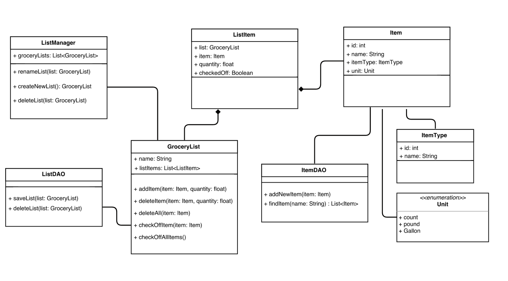

#Design 1

Pros
- Responsibilities are splitted across different classes
- The granularity of details is reasonable
- Having the enumeration of the unit is a good abstraction

Cons
- The DAO classes can be aggregated into a single classes
- The functionality for searching items should belong to a higher level class
- There is no User entity representation

#Design 2

Pros
- GroceryListAdministartor class provides a high level abstraction of the list
- Fair distribution of operations and attributes across the different classes
- Included  a user class which will be used to extend the functionality. This probably need to be supported with a user management class

Cons
- The ItemDao attributes will fit better in an Item class
- itemQty attribute in the GroceryList class would fit better in an Item class
- The GroceryList calss is a little bit bloated compared to other classes

#Design 3

Pros
- DBManager class wraps up all the database interaction

Cons
- There is no User entity representation

#Design 4

Pros
- Attributes and operations represent all requirements

Cons
- ShoppingList class is bloated
- The Hierarchy implementation can be done with a map of ItemType and List
- Item, tem Quantity and Unit of measurement can be factored out as its own class

#Team Design 

- We have decided to create a hybrid design based on Design 1 and Design 3
- Most of the classes that exist in the individual design documents are also represented in the team design. 
- We have shuffled around the attribute, operations and class names to come up with a team design that represents the requirement more accurately
- One major addition to the team design is the introduction of User and UserManagement classes.  Even though the concept of User is not explicit specified in the requirement document after a thorough consideration we felt that this feature needs to be included in order to make the design complete.

#Summary

- We were efficient on going through all designs. We worked as a team to identify the pros and the cons on each design.
- Based on our review of individual designs we have created a hybrid design based on Design 1 and 3
- The main considerations during the design review process was
    - Accurate representation of requirement
    - Reasonable distribution of attributes and operations across different classes
    - Representation of a Class that deals with database CRUD operations
- We have cross verified the original requirement with our final design to make sure that it all requirements are fully satisfied

